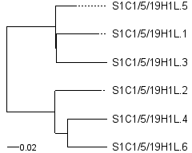

# print phylogenetic newick tree
Creates an image with a phylogenetic tree from the input Newick file.

## Simple usage
```
printPhyloNewickTree.R -i input.nwk
```
By default, the image is saved to tree-input.nwk.png file (can be specified with `-o` option).

## Input Newick file
You can create Newick file(s) from FASTA alignment(s) using MEGACC:
```
find . -name "*.fasta" -exec sh -c 'megacc -n -a ~/MEGACC-analysis-options-files/infer_ME_nucleotide.mao -d {} -o {} 1>/dev/null' \;
```

## Output image
Option `-o` or `--output` allows you to specify a name of the output filename.



### Option width and height
By default, the image sizes are set automatically, the width is constant and is
equal to 3 inches, the height is calculated based on the number of tree nodes.
At the moment, automatic settings of image sizes does not always produce a nice
picture (this can be improved in the future), but it allows processing multiple
files at the same time. The `--width` and `--height` options allow you to set the desired
values (in inches) for each image separately.

